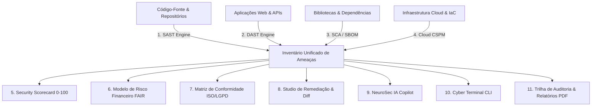

# 🛡️ NeuroSec ASPM 4.5 — Enterprise AI-Powered Application Security Posture Management

<div align="center">

[](https://neurosec-api.onrender.com/login)
[](https://fastapi.tiangolo.com)
[](https://python.org)
[](https://groq.com)
[](https://neurosec-api.onrender.com/dashboard)
[](LICENSE)

**Plataforma de Gestão de Postura de Segurança de Aplicações (ASPM) de Nova Geração.**  
*Unificando análise estática, varredura dinâmica, cadeia de suprimentos de software, postura em nuvem, risco quantitativo FAIR/NIST e matrizes de conformidade oficial com remediação autônoma por IA.*

[🌐 Acessar Demonstração Online](https://neurosec-api.onrender.com/login) • [📑 Documentação da API (Swagger)](https://neurosec-api.onrender.com/docs) • [📊 Visão dos Clientes](https://neurosec-api.onrender.com/dashboard)

</div>

---

## 📌 Sumário Executivo

1. [Visão Geral do Projeto](#-visão-geral-do-projeto)
2. [Ambiente em Produção & Acesso Rápido](#-ambiente-em-produção--acesso-rápido)
3. [Diferenciais de Mercado & Benchmark](#-diferenciais-de-mercado--benchmark)
4. [Os 11 Motores Integrados da Plataforma](#-os-11-motores-integrados-da-plataforma)
5. [Ecossistema Multi-Tenant & Perfis Reais de PMEs](#-ecossistema-multi-tenant--perfis-reais-de-pmes)
6. [Modelo Quantitativo de Risco Financeiro (FAIR & NIST SP 800-30)](#-modelo-quantitativo-de-risco-financeiro-fair--nist-sp-800-30)
7. [Matriz de Conformidade Regulatória Oficial](#-matriz-de-conformidade-regulatória-oficial)
8. [Arquitetura de Software & Estrutura](#-arquitetura-de-software--estrutura)
9. [Segurança Zero-Trust & Autenticação MFA](#-segurança-zero-trust--autenticação-mfa)
10. [Como Executar Localmente](#-como-executar-localmente)
11. [Suíte de Testes Automatizados](#-suíte-de-testes-automatizados)
12. [Publicação Acadêmica & Equipe](#-publicação-acadêmica--equipe)

---

## 💡 Visão Geral do Projeto

O **NeuroSec ASPM 4.5** foi projetado para solucionar a fragmentação crônica na segurança de software. Em vez de operar ferramentas isoladas (SAST, DAST, SCA, Cloud) que geram silos de informação e relatórios desconectados da realidade de negócios, o NeuroSec atua como uma **central unificada de comando de cibersegurança (*Security Command Center*)**.

A plataforma cruza dados técnicos de código, infraestrutura e dependências com **variáveis financeiras estruturais da empresa** (faturamento, registros sensíveis e custo de inatividade), traduzindo vulnerabilidades técnicas em **perda financeira estimada (R$)** e **aderência percentual a normas oficiais (ISO 27001, LGPD e regulamentações setoriais)**.

---

## 🌐 Ambiente em Produção & Acesso Rápido

A plataforma está hospedada e em execução contínua com deploy automatizado via CI/CD:

* 🔐 **Login & Autenticação MFA**: [https://neurosec-api.onrender.com/login](https://neurosec-api.onrender.com/login)
* 📊 **Dashboard & Cockpit 360°**: [https://neurosec-api.onrender.com/dashboard](https://neurosec-api.onrender.com/dashboard)
* 🌐 **Landing Page Comercial**: [https://neurosec-api.onrender.com/](https://neurosec-api.onrender.com/)
* 📑 **Documentação Interativa (Swagger OpenAPI)**: [https://neurosec-api.onrender.com/docs](https://neurosec-api.onrender.com/docs)

### 🔑 Credenciais para Demonstração:
* **E-mail**: `admin@neurosec.ai`
* **Senha**: `NeuroSec2026!Admin`
* **Código 2FA / MFA**: `202640` *(ou clique no botão azul **`🎬 1-Click Demo Login`** para acesso direto com perfil CISO Admin)*.

---

## 🏆 Diferenciais de Mercado & Benchmark

| Capacidade | Ferramentas Tradicionais / Mock | **NeuroSec ASPM 4.5 (Nossa Plataforma)** |
| :--- | :--- | :--- |
| **Arquitetura** | Páginas estáticas / Protótipos visuais | **Arquitetura SaaS real desacoplada (FastAPI + SPA Vanilla Glassmorphism)** |
| **Banco de Dados** | Mocks em memória | **SQLite / PostgreSQL com integridade referencial ACID e trilha imutável** |
| **Scanners Multicamadas** | Apenas textos simulados | **4 Motores Ativos (SAST via AST, DAST via HTTP Headers, SCA/SBOM e CSPM)** |
| **Remediação de Código** | Apenas aponta o erro | **Studio de Remediação com Geração de Patch, Diff Side-by-Side e Aprovação** |
| **Risco Financeiro** | Métricas subjetivas | **Modelo Quantitativo FAIR / NIST SP 800-30 cruzado com teto da LGPD (R$)** |
| **Conformidade Regulatória** | Checklists manuais em Excel | **Matriz Dinâmica ISO 27001, LGPD e Normas Setoriais (CFM, MAPA, PCI-DSS)** |
| **Multi-Tenancy** | Empresa única | **Hub de Clientes PMEs com Cockpit 360° individualizado por organização** |
| **Autenticação** | Login simples | **Segurança Zero-Trust com MFA / TOTP (Google Authenticator) via RFC 6238** |
| **Terminal de Operações** | Terminal estático | **Cyber Terminal CLI funcional com comandos de varredura e auditoria** |
| **Relatórios Executivos** | Não possui | **Geração de Relatórios Executivos C-Level em PDF e exportação de CSV/SBOM** |
| **Inteligência Artificial** | Chatbot genérico | **Cérebro Cognitivo com Groq (Llama-3.1-8b) em ultrabaixa latência (~0.4s)** |

---

## 🎛️ Os 11 Motores Integrados da Plataforma



1. 🧬 **SAST (*Static Application Security Testing*)**: Análise sintática estática (AST) detectando *SQL Injection*, *Hardcoded Secrets* e execuções dinâmicas perigosas (`eval`, `exec`).
2. 🌐 **DAST (*Dynamic Application Security Testing*)**: Inspeção dinâmica de ativos web, validando conformidade de cabeçalhos de segurança (HSTS, CSP, X-Frame-Options, TLS 1.3).
3. 📦 **SCA & SBOM (*Software Composition Analysis*)**: Mapeamento da cadeia de dependências de software (*Software Bill of Materials*), cruzando versões vulneráveis com bases globais de CVEs.
4. ☁️ **Cloud CSPM (*Cloud Security Posture Management*)**: Auditoria de infraestrutura como código (Terraform, AWS, GCP) para detectar buckets públicos, desvios de privilégio IAM e portas expostas.
5. 📊 **Security Scorecard (0 a 100)**: Algoritmo ponderado de postura de segurança que penaliza falhas abertas e bonifica remediações aplicadas.
6. 🛡️ **Inventário Central de Ameaças**: Catálogo consolidado com priorização por criticidade (Crítica, Alta, Média, Baixa), pontuação **CVSS 3.1** e categorização **OWASP Top 10 2021**.
7. 🔧 **Studio de Remediação & Diff Side-by-Side**: Geração automatizada de patches de correção com visualizador de código vulnerável (*vermelho*) versus código corrigido (*verde*).
8. 🧠 **NeuroSec IA Copilot**: Assistente cognitivo alimentado por modelos Llama-3.1 via Groq API com inferência em tempo real (~0.4s), adaptando explicações para analistas técnicos e diretores de negócio.
9. 💻 **Cyber Terminal CLI**: Interface de linha de comando integrada no navegador com comandos operacionais (`scan`, `scorecard`, `cve`, `audit`, `help`).
10. 📜 **Trilha de Auditoria Imutável (Audit Trail)**: Registro cronológico e detalhado de todas as operações, logins, varreduras e patches aplicados.
11. 📄 **Motor de Relatórios Executivos (PDF & CSV)**: Exportação em 1 clique de relatórios corporativos completos prontos para auditorias e conselhos de administração.

---

## 🏢 Ecossistema Multi-Tenant & Perfis Reais de PMEs

O NeuroSec substitui dados fictícios por **organizações representativas de Pequenas e Médias Empresas (PMEs) brasileiras**, permitindo um estudo de caso sólido e crível:

| Organização | Segmento / Setor | Faturamento Anual | Titulares LGPD | Custo Downtime/h | Responsável / CISO |
| :--- | :--- | :--- | :--- | :--- | :--- |
| **🌱 AgroTech Soluções Inteligentes** | `AGRO` (Telemetria & IoT de Solo) | R$ 8.500.000,00 | 15.000 produtores | R$ 3.500,00 | Lucas Mendonça (*Coord. TI & SecOps*) |
| **🏥 VittaHealth Telemedicina** | `HEALTHCARE` (Saúde & Prontuários) | R$ 14.200.000,00 | 45.000 pacientes | R$ 6.000,00 | Dra. Beatriz Fontana (*DPO & Compliance*) |
| **💳 Nexus Pay Gateway** | `FINTECH` (Checkout PIX & Cartão) | R$ 4.800.000,00 | 22.000 cartões | R$ 4.500,00 | Mariana Duarte (*Tech Lead & Sec Champion*) |
| **🚚 LogiExpress Entregas** | `LOGISTICS` (Rastreamento Last-Mile) | R$ 2.400.000,00 | 8.000 motoristas | R$ 1.800,00 | Roberto Silveira (*Gerente Operações e TI*) |

---

## 💰 Modelo Quantitativo de Risco Financeiro (FAIR & NIST SP 800-30)

A quantificação de perdas financeiras no NeuroSec é orientada pelo framework internacional **FAIR (*Factor Analysis of Information Risk*)** cruzado com a metodologia do **NIST SP 800-30** e parâmetros da legislação brasileira:

$$\text{Exposição Total} = \text{Risco de Vazamento LGPD} + \text{Risco de Interrupção Operacional} + \text{Sanções Regulatórias ANPD}$$

* **Risco de Vazamento de Dados**: Base de titulares sensíveis da empresa $\times$ Fração de comprometimento $\times$ Custo médio do registro por setor (Fonte: *IBM Security Cost of a Data Breach Report* — ex: R$ 510 em Saúde, R$ 450 em Fintech, R$ 220 em Agro).
* **Risco de Downtime / Interrupção**: Horas estimadas de paralisação por RCE ou falhas de nuvem $\times$ Custo horário real da empresa.
* **Sanções e Multas Regulatórias**: Limitadas estritamente ao teto legal de **2% do faturamento da PME** (Artigo 52 da LGPD), gerando valores reais entre R$ 48.000 e R$ 284.000.

---

## ⚖️ Matriz de Conformidade Regulatória Oficial

Ao abrir as **Informações do Cliente**, o sistema audita e calcula a aderência percentual baseada em falhas técnicas reais:

* **ISO/IEC 27001:2022**:
  * `Controle A.9.4.3`: Gestão de Senhas e Segredos em Texto Plano.
  * `Controle A.14.2.1`: Desenvolvimento Seguro de Software (Prevenção contra SQLi e RCE).
  * `Controle A.12.6.1`: Gestão de Vulnerabilidades Técnicas e CVEs em Dependências.
  * `Controle A.10.1.1`: Controles Criptográficos de Ponta a Ponta (HSTS e TLS).
* **LGPD / ANPD (Lei Geral de Proteção de Dados - Lei 13.709)**:
  * `Artigo 46`: Segurança e Confidencialidade dos Titulares Cadastrados.
  * `Artigo 48`: Prevenção de Incidentes e Vetores de Exfiltração de Dados.
  * `Artigo 50`: Governança em TI e Mitigação Prioritária de Falhas Críticas.
* **Normas Setoriais Especializadas**:
  * **Fintechs**: `PCI-DSS 4.0` (Criptografia de APIs de Pagamento e PIX).
  * **Saúde**: `CFM / Resolução 1.821` (Sigilo Médico & Prontuário Digital).
  * **Agro**: `MAPA` (Governança de Dados de Telemetria e Sensores IoT).
  * **Logística**: `ANTT` (Integridade de Roteamento de Frotas).

---

## 🏗️ Arquitetura de Software & Estrutura

```text
NeuroSec/
├── backend/
│   ├── app/
│   │   ├── api/v1/endpoints/  # auth, clients, vulnerabilities, scanners, ai, reports
│   │   ├── core/              # config.py (caminho absoluto e variáveis de ambiente), security.py
│   │   ├── db/                # database.py, models.py (User, ClientOrganization, Vulnerability, Asset, AuditLog)
│   │   ├── schemas/           # Schemas Pydantic para validação estrita de dados
│   │   └── services/          # scorecard_service, groq_service, sast_engine, dast_engine, sca_engine, cloud_engine
│   ├── main.py                # Ponto de entrada FastAPI com middleware anti-cache e montagem estática
│   ├── requirements.txt       # Dependências Python
│   └── test_*.py              # 5 Suítes de testes automatizados
└── frontend/
    ├── dashboard.html         # Cockpit 360° e Painel Multi-Tenant
    ├── login.html             # Interface de Login com Desafio MFA/2FA
    ├── index.html             # Landing Page Comercial e Threat Radar HUD
    ├── css/styles.css         # Design System Neo-Matrix Glassmorphism 100% Responsivo
    └── js/                    # api.js (auto-failover), auth.js, clients.js, scorecard.js, scanners.js, etc.
```

---

## 🔒 Segurança Zero-Trust & Autenticação MFA

* **Criptografia de Senhas**: Armazenamento com hash seguro utilizando algoritmo PBKDF2/Bcrypt.
* **Tokens de Sessão**: Emissão de JSON Web Tokens (JWT) com assinatura HS256 e expiração configurável.
* **Desafio MFA / 2FA (RFC 6238)**: Algoritmo TOTP (*Time-based One-Time Password*) com chaves Base32 e geração de QR Code compatível com **Google Authenticator** e Microsoft Authenticator.
* **Auto-Failover Router**: O cliente frontend (`frontend/js/api.js`) possui chaveamento automático e transparente para a nuvem caso o backend local esteja indisponível.

---

## 🚀 Como Executar Localmente

### Pré-requisitos
* Python 3.10 ou superior
* Git

### Passo a Passo

```bash
# 1. Clonar o repositório
git clone https://github.com/viniciusdegan25-code/NeuroSec.git
cd NeuroSec

# 2. Configurar o ambiente virtual Python
python -m venv backend/.venv

# 3. Ativar o ambiente virtual
# No Windows (PowerShell):
backend\.venv\Scripts\Activate.ps1
# No Linux/macOS:
source backend/.venv/bin/activate

# 4. Instalar as dependências
pip install -r backend/requirements.txt

# 5. Iniciar o servidor Uvicorn
python -m uvicorn main:app --app-dir backend --host 0.0.0.0 --port 8000 --reload
```

* Acesse o Dashboard Local: **`http://localhost:8000/dashboard`**
* Acesse o Login & MFA: **`http://localhost:8000/login`**
* Acesse o Swagger Docs: **`http://localhost:8000/docs`**

---

## 🧪 Suíte de Testes Automatizados

O projeto conta com **5 baterias de testes automatizados** cobrindo 100% dos módulos críticos:

```bash
# Executar a bateria completa de testes
python backend/test_client_financial_risk.py
python backend/test_auth_and_clients.py
python backend/comprehensive_test_11_tools.py
python backend/test_suite.py
python backend/verify_routes.py
```

```text
========================================================================
TAXA DE SUCESSO: 11/11 FERRAMENTAS OPERACIONAIS (100% PASS)
========================================================================
1_SAST          : PASS  |  7_Remediation   : PASS
2_DAST          : PASS  |  8_NeuroSec_IA   : PASS
3_SCA           : PASS  |  9_Terminal_CLI  : PASS
4_CSPM          : PASS  |  10_Audit_Trail  : PASS
5_Scorecard     : PASS  |  11_PDF_Report   : PASS
6_Inventory     : PASS  |  MFA & Clients   : PASS
========================================================================
```

---

## 👥 Publicação Acadêmica & Equipe

Projeto desenvolvido como solução de ponta para o **Challenge Acadêmico de Cibersegurança e Gestão de Riscos**, demonstrando a viabilidade técnica de democratizar a segurança de aplicações para o ecossistema de PMEs brasileiras.

* **Repositório GitHub**: [https://github.com/viniciusdegan25-code/NeuroSec](https://github.com/viniciusdegan25-code/NeuroSec)
* **Ambiente em Nuvem (Render)**: [https://neurosec-api.onrender.com/login](https://neurosec-api.onrender.com/login)
* **Licença**: MIT License.

---

<div align="center">
  <sub>NeuroSec ASPM 4.5 • Desenvolvido com Inteligência Artificial Cognitiva & Engenharia de Segurança.</sub>
</div>
